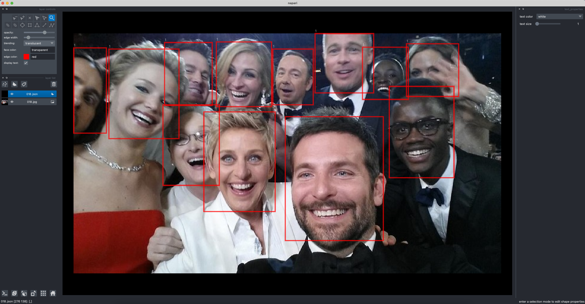

# PyTorch Faster-RCNN Tutorial

**A beginner-friendly tutorial to start an object detection deep learning project with
[PyTorch](https://pytorch.org/) & the [Faster-RCNN architecture](https://arxiv.org/pdf/1506.01497.pdf).**
Based on the blog
series ["Train your own object detector with Faster-RCNN & PyTorch"](https://johschmidt42.medium.com/train-your-own-object-detector-with-faster-rcnn-pytorch-8d3c759cfc70)

## Summary

A complete jupyter notebook for training can be found in the [training script](training_script.ipynb). Alternatively,
there is the same [training script](training_script.py) as a `.py` file.

Besides the training script, I provide jupyter-notebooks to create & explore a dataset, run inference and visualize
anchor boxes:

- [Dataset exploration](dataset_exploration_script.ipynb)
- [Data annotation](annotation_script.ipynb)
- [Anchor visualization](anchor_script.ipynb)
- [Inference](inference_script.ipynb)
- [Renaming script](rename_files_script.ipynb)

The [visual.py](pytorch_faster_rcnn_tutorial/visual.py) script contains the code to visualize a dataset, a list of
images, anchor boxes or to create annotations for a dataset. The provided code for this script was written around
napari [0.4.9](https://napari.org/docs/dev/release/release_0_4_9.html). Other dependencies can be found
in [requirements.txt](requirements.txt).

## Installation

1. Set up a new environment with an environment manager (recommended):
    1. [conda](https://docs.conda.io/en/latest/miniconda.html):
        1. `conda create --name faster-rcnn-tutorial -y`
        2. `conda activate faster-rcnn-tutorial`
        3. `conda install python=3.8 -y`
    2. [venv](https://docs.python.org/3/library/venv.html):
        1. `python3 -m venv faster-rcnn-tutorial`
        2. `source faster-rcnn-tutorial/bin/activate`
2. Install the libraries:
   `pip install -r requirements.txt`
3. Start a jupyter server:
   `jupyter-notebook` OR `jupyter-lab`

**Note**: This will install the CPU-version of torch. If you want to use a GPU or TPU, please refer to the instructions
on the [PyTorch website](https://pytorch.org/). To check whether pytorch uses the nvidia gpu, check
if `torch.cuda.is_available()` returns `True` in a python shell.

**Windows user**: If you can not start jupyter-lab or jupyter-notebook on Windows because of
`ImportError: DLL load failed while importing win32api`, try to run `conda install pywin32` with the conda package
manager.

## Dependencies

These are the libraries that are used in this project:

- High-level deep learning library for PyTorch: [PyTorch Lightning](https://www.pytorchlightning.ai/)
- Visualization software: Custom code with the image-viewer [Napari](https://napari.org/)
- [OPTIONAL] Experiment tracking software/logging module: [Neptune](https://neptune.ai/)

If you want to use [Neptune](https://neptune.ai/) for your own experiments, add the `NEPTUNE` environment variable to
your system. Otherwise, deactivate it in the scripts.

## Dataset

The [dataset](/Users/johannes/workspace/PyTorch-Object-Detection-Faster-RCNN-Tutorial/pytorch_faster_rcnn_tutorial/data)
consists of 20 selfie-images randomly selected from the internet.

## Faster-RCNN model

Most of the model's code is based on PyTorch's Faster-RCNN implementation. Metrics can be computed based on
the [PASCAL VOC](http://host.robots.ox.ac.uk/pascal/VOC/) (**V**isual **O**bject **C**lasses) evaluator in
the [metrics section](pytorch_faster_rcnn_tutorial/metrics).

## Anchor Sizes/Aspect Ratios

Anchor sizes/aspect ratios are really important for training a Faster-RCNN model (but also similar models like SSD,
YOLO). These "default" boxes are compared to those outputted by the network, therefore choosing adequate sizes/ratios
can be critical for the success of a project. The PyTorch implementation of the AnchorGenerator (and also the helper
classes here) generally expect the following format:

- anchor_size: `Tuple[Tuple[int, ...], ...]`
- aspect_ratios: `Tuple[Tuple[float, ...]]`

### Without FPN

The ResNet backbone without the FPN always returns a single feature map that is used to create anchor boxes. Because of
that we must create a `Tuple` that contains a single `Tuple`: e.g. `((32, 64, 128, 256, 512),)` or `(((32, 64),)`

### With FPN

With FPN we can use 4 feature maps (output from a ResNet + FPN) and map our anchor sizes with the feature maps. Because
of that we must create a `Tuple` that contains exactly **4** `Tuples`: e.g. `((32,), (64,), (128,), (256,))`
or `((8, 16, 32), (32, 64), (32, 64, 128, 256, 512), (200, 300))`

## Examples

Examples on how to create a Faster-RCNN model with pretrained ResNet backbone (ImageNet), examples are given in
the [tests section](tests). Pay special attention to
the [test_faster_RCNN.py::test_get_faster_rcnn_resnet](tests/test_faster_RCNN.py). Recommendation: Run the test in debugger mode.

## Notes

- Sliders in the [inference script](inference_script.ipynb) do not work right now due to dependency updates.
